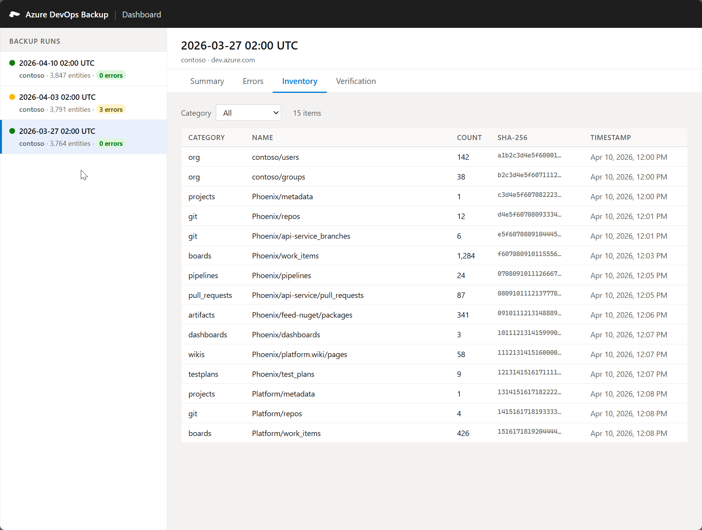

# Azure DevOps Backup Utility

<table><tr><td>
<strong>&#9888;&#65039; Warning</strong><br><br>
This project has been generated with the assistance of Anthropic's Claude LLM models.<br>
Please be aware of this before running it against production systems, and take the time to understand how the project works before using it.
</td></tr></table>

A non-interactive **pull-and-store** backup tool for Azure DevOps that uses only Azure CLI (`az devops`) and Git CLI to retrieve and persist data. There is no automated restore functionality - Azure DevOps does not provide programmatic restore APIs. Designed for CI/CD pipelines with zero external Python dependencies.

## Dashboard Preview

[](dashboard/preview.png)

## Features

- **Broad data coverage** - organisations, projects, repos, pull requests, boards, pipelines, artifacts, dashboards, permissions, wikis, and test plans
- **Azure CLI only** - all API access via `az devops` / `az devops invoke`; no direct HTTP clients
- **Standard library only** - no pip dependencies beyond Python >= 3.9
- **Non-interactive** - designed for CI/CD (Azure Pipelines, GitHub Actions)
- **Automatic pagination** - continuation token handling so large result sets are never silently truncated
- **Incremental filtering** - `--since` flag filters work items and pipeline runs by date
- **Resilient** - exponential backoff with jitter, throttle-aware retries, partial progress tracking
- **Redaction** - sensitive fields (secrets, tokens, passwords, `isSecret` variables) automatically masked before persisting
- **Secure credential handling** - PAT passed to git via environment variables (never in process arguments or on-disk config)
- **Hardened output** - backup directories created with restricted permissions (`0700` on Unix)
- **Integrity verification** - SHA-256 checksums per file; archives verified before source deletion
- **Compression** - per-repo, per-project, or full backup compression
- **Dashboard** - lightweight Azure Function with web UI for reviewing backup history, errors, and verification results

## Prerequisites

| Requirement | Version |
|---|---|
| Python | >= 3.9 |
| Azure CLI | >= 2.30 |
| Azure DevOps CLI extension | Auto-installed if missing |
| Git | Any recent version |

## Quick Start

```bash
export AZURE_DEVOPS_ORG_URL="https://dev.azure.com/your-org"
export AZURE_DEVOPS_EXT_PAT="your-personal-access-token"  # optional

PYTHONPATH=src python src/cli.py
```

## Documentation

Full documentation is at **[christopher-talke.github.io/azure-devops-backup-utility](https://christopher-talke.github.io/azure-devops-backup-utility/)**:

- [Installation & Prerequisites](https://christopher-talke.github.io/azure-devops-backup-utility/guide/installation)
- [Authentication (Pipeline Identity + PAT)](https://christopher-talke.github.io/azure-devops-backup-utility/guide/authentication)
- [Configuration (CLI flags, env vars, YAML)](https://christopher-talke.github.io/azure-devops-backup-utility/guide/configuration)
- [Output Structure](https://christopher-talke.github.io/azure-devops-backup-utility/guide/output-structure)
- [CI/CD Examples](https://christopher-talke.github.io/azure-devops-backup-utility/guide/ci-cd)
- [Backup Components](https://christopher-talke.github.io/azure-devops-backup-utility/reference/components)
- [Security & Redaction](https://christopher-talke.github.io/azure-devops-backup-utility/reference/security)
- [Integrity & Verification](https://christopher-talke.github.io/azure-devops-backup-utility/reference/verification)
- [Observability Dashboard](https://christopher-talke.github.io/azure-devops-backup-utility/dashboard/)

## CI/CD Examples

Ready-to-use pipeline definitions are in the [`examples/`](examples/) folder for Azure Pipelines and GitHub Actions, with upload targets for build artifacts, Azure Blob Storage, and AWS S3.

## Contributing

See [DEVELOPMENT.md](DEVELOPMENT.md) for development setup, architecture, testing, and contribution guidelines.

## Licence

MIT - See [LICENSE](LICENSE).
